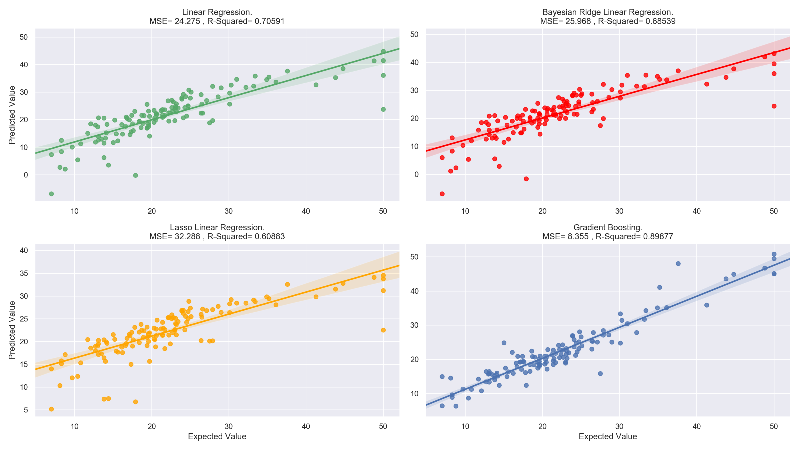
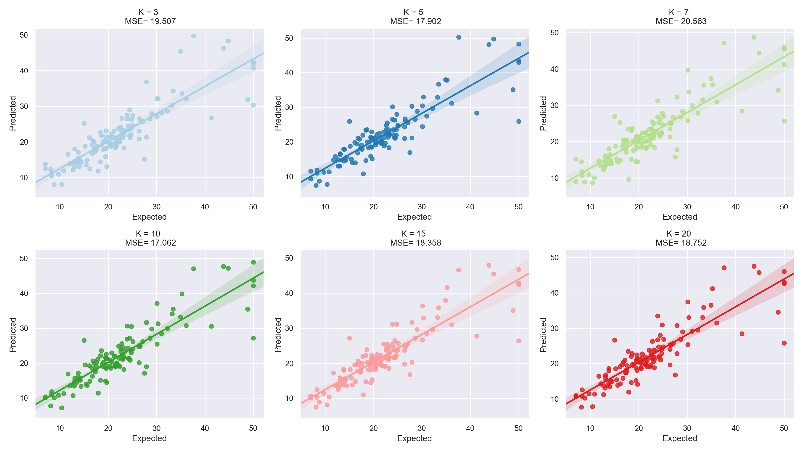
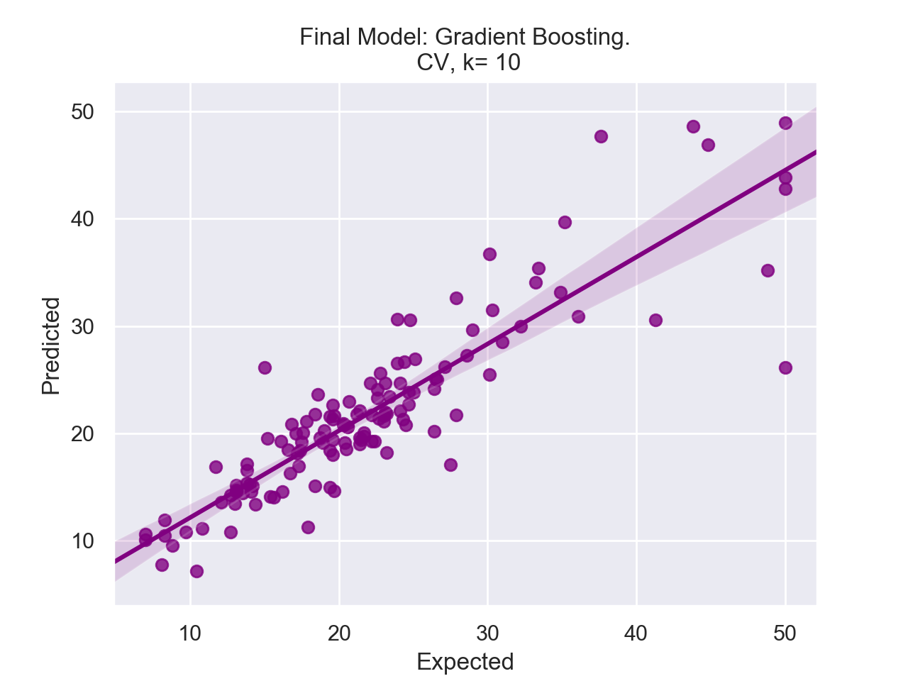

# Boston_Analysis
This is the final project of CEBD-1160 course, based on Boston housing dataset.

| Name | Date |
|:-------|:---------------|
| Arwa Sheraky | 28 March, 2019 |

-----

### Resources
This repository includes:

- Python script for boston-housing-data analysis: `boston_analysis.py`
- Results figures: `Figures/`
- Dockerfile for experiment: `Dockerfile`
- runtime-instructions: `RUNME.md`

-----

## Research Question
Knowing the average prices of houses and the features that could affect them, could we predict the average prices of new houses, having their 13 features? What would be the accuracy of that prediction?

### Introduction
The dataset used in this project is publically shared on scikit-learn [datasets](https://scikit-learn.org/stable/datasets/index.html#boston-dataset), and could be explicitly imported into any python app, from `sklearn` library.
The data was collected in suburbs of Boston from the 1970s, including 13 features of 506 instances:

```
CRIM: Per capita crime rate by town
ZN: Proportion of residential land zoned for lots over 25,000 sq. ft
INDUS: Proportion of non-retail business acres per town
CHAS: Charles River dummy variable (= 1 if tract bounds river; 0 otherwise)
NOX: Nitric oxide concentration (parts per 10 million)
RM: Average number of rooms per dwelling
AGE: Proportion of owner-occupied units built prior to 1940
DIS: Weighted distances to five Boston employment centers
RAD: Index of accessibility to radial highways
TAX: Full-value property tax rate per $10,000
PTRATIO: Pupil-teacher ratio by town
B: 1000(Bk — 0.63)², where Bk is the proportion of [people of African American descent] by town
LSTAT: Percentage of lower status of the population
MEDV: Median value of owner-occupied homes in $1000s
```

Here's a simple pseudocode of what we're doing in this analysis: [Pseudocode](Pseudocode.md), but the main goal of this project is to build a strong regression model to predict the prices of houses. This is done based on existing trainig data using the 13 features of each house. The following will explain how we tried to acheive this goal.

### Methods

* By applying different regressors and comparing their performance using [R-squared](https://scikit-learn.org/stable/modules/generated/sklearn.metrics.r2_score.html) and [MSE](https://en.wikipedia.org/wiki/Mean_squared_error), we can find the best one to solve the problem. The used regressors are:
    * [Linear Regression](https://scikit-learn.org/stable/modules/generated/sklearn.linear_model.LinearRegression.html#sklearn.linear_model.LinearRegression).
    * [Bayesian Ridge](https://scikit-learn.org/stable/modules/generated/sklearn.linear_model.BayesianRidge.html#sklearn.linear_model.BayesianRidge).
    * [Lasso](https://scikit-learn.org/stable/modules/generated/sklearn.linear_model.Lasso.html#sklearn.linear_model.Lasso).
    * [Gradient Boosting](https://scikit-learn.org/stable/modules/generated/sklearn.ensemble.GradientBoostingRegressor.html#sklearn.ensemble.GradientBoostingRegressor).

* After that, using cross validation to build the model would make it stronger and increase its performance. So, with `k-fold = [3, 5, 7, 10, 15, 20]`, we chose the most accurate k and finally built the model using these information (Regressor and k).

### Results



| Model | Linear Regression | Bayesian Ridge | Lasso | Gradient Boosting |
|:---------------|:---------------|:---------------|:---------------|:---------------|
| MSE | 24.275 | 25.968 | 32.288 | 8.355 |

As shown in the previous subplots and performance table, **Gradient Boosting Regressor** was the best model to predict the average prices as close to the real values as possible, with minimum MSE and maximum R-Squared. In addition, there is a very wide gap between the accuracy of this model and the others!



By applying cross validation to the chosen regressor and comparing 6 different values of k-fold, we noticed that `k = 10` has the least MSE and the most accurate results.

According to the previous observations and calculations, the ideal regressor is **Gradient Boosting** and the best k-fold of Cross Validation modeling is **k=10**. Using these data we can easily build the best model that could predict the price values as close as possible. The plot below shows the final model, with `MSE = 17.062`:




- The algorithm of the Gradient Boosting regressor can be found [here](https://en.wikipedia.org/wiki/Gradient_boosting#Algorithm), and how the regressor works on python is on scikit-learn documentation, mentioned above.
- The Cross Validation method used here, is [`cross_val_predict`](https://scikit-learn.org/stable/modules/generated/sklearn.model_selection.cross_val_predict.html#sklearn.model_selection.cross_val_predict), built by scikit-learn.

### Discussion

Gradient Boosting was the best at solving the problem among 4 randomly chosen regressors, with a `Mean Square Error of 17.062`. There might be better methods to solve this problem with a less chance of error and a better accuracy. These methods could be discoverd later by understanding the dataset and studying Data Science field in a deeper way.

### Libraries
- The main used libraries in this analysis are:
    - `pandas` and `numpy`: Creating Dataframes and calculating statistical summary.
    - `matplotlib`, `seaborn` and `plotly`: Plotting histograms, scatterplots and regression lines.
    - `sklearn`: Importing the dataset, splitting data, applying regressors and CV and calculating performance.

### Refrences
All refrences is included above.

-------
